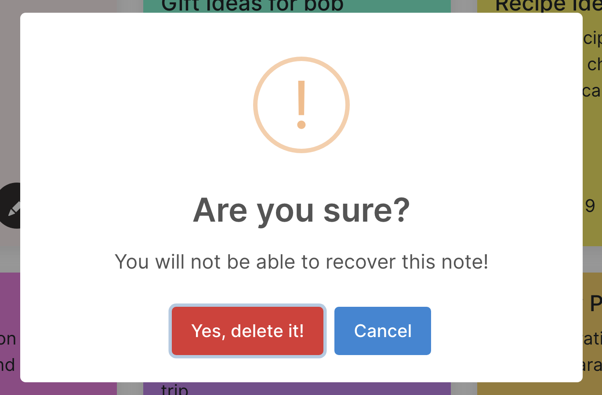

#  iNotes Notes taking App 

iNotes is a full-stack app based on React, Mongodb, Mongoose, Express and Node.js.

### 🔎 Explore My App

#### Getting Started
To run the project locally, please follow these steps:

##### Backend Setup
Navigate to the api directory:
cd api

##### Install the required dependencies:
npm install

Create a file named .env in the api directory, and declare the following variables:
DATABASE_URL: Your MongoDB Atlas URL.
PORT: Set this to 3500.

##### Frontend Setup
Navigate to the frontend directory:
cd ../frontend

##### Install the required dependencies:
npm install

#### Running the Project

##### Backend
To start the backend server, run:
npm run dev

Frontend
To start the frontend development server, run:
npm start

Once both the backend and frontend servers are running, you can access the application in your web browser.

📝 Wireframes 

### 📷 App Screenshots

### 🚀 Next Steps

-   Let the user add categories 
-   Add functionality of uploading images